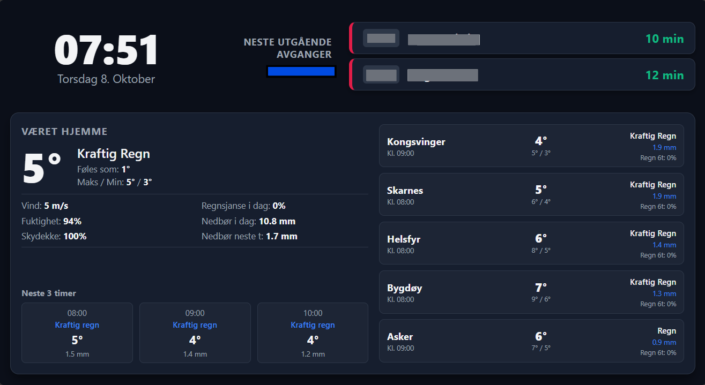

# 🚪 Entré Dashbord (Entryway Dashboard)

A lightweight, responsive Single Page Application (SPA) designed for an entry/hallway display kiosk (running on an old laptop, e.g., ASUS UL30A) hosted via Docker on a home server.

It provides real-time local public transport departures from Ruter/Entur alongside local weather and destination forecast data from MET Norway (Yr).

---

## ✨ Features

- **Dark Mode UI:** Designed specifically for high contrast and high legibility from 2–3 meters away.
- **Local Public Transit (Ruter / Entur):** Real-time countdown for upcoming outward departures, filtering out incoming/opposite-direction buses.
- **Home Weather (MET Norway / Yr):** Current conditions, calculated "Føles som" (perceived temperature), cloud cover, wind speed, humidity, and today's rain statistics (total amount + next 60 min).
- **Travel Weather Cards:** Multi-destination forecast cards calibrated using custom travel times to show expected conditions and rainfall upon arrival.

---

## 🛠️ Tech Stack

- **Frontend:** Vanilla HTML5, CSS3 (CSS Grid & Flexbox), Modern JavaScript (ES6+).
- **Backend:** Node.js + Express proxy (handles CORS, safely attaches required `User-Agent` and `ET-Client-Name` headers for MET Norway and Entur APIs).
- **Deployment:** Docker, GitHub Actions (GHCR), managed on home server via **Dockge**.

---

## Project Overview 💻

The entryway dashboard is a part of an old laptop reuse project. I got an old laptop for free and wanted to use it for something useful. This project came about from wanting to reuse rather than throw away.

I transformed an older ASUS UL30A laptop (Intel ULV CPU, built-in webcam) into a dedicated, low-power home entry kiosk displaying a local dashboard (`http://10.0.0.4:8181`). On the way, I replaced the CMOS battery and broke the laptop keyboard's ribbon cable. It can tell time accurately now, but no key will work on the keyboard. For an entryway dashboard that does not matter though. While slightly inconvenient, I can bring a keyboard over whenever I need to make real changes.

---

### Technical Specifications & Architecture

- **Hardware:** ASUS UL30A (64-bit Intel Celeron/Core 2 Duo ULV, built-in webcam, touchpad)
- **Operating System:** antiX Linux 26.1 (64-bit Full Edition) with IceWM
- **Init System:** `runit`
- **Primary Display Mode:** Fullscreen Chromium in `--kiosk` mode
- **Display Power Management:** X11 DPMS with motion and touchpad unified waking
- **Custom script for brighness control:** Custom python script that controls screen brightness

---

### Summary of Configured Components

#### 1. OS Installation & Autologin

- Installed antiX Linux 26.1
- Configured passwordless autologin via `autologin-user=kiosk` in `/etc/lightdm/lightdm.conf` and antiX `desktop-session.conf`.

#### 2. Kiosk Autostart (`~/.icewm/startup`)

- Set up automated launching for IceWM sessions:
  - Grants local display access (`xhost +local:`).
  - Waits 3 seconds (`sleep 3`) for desktop session initialization to avoid race conditions overriding display power configurations.
  - Hides the cursor automatically after 2 seconds of inactivity using `unclutter`.
  - Clears previous unclean shutdown prompts from Chromium preferences (`sed`).
  - Launches Chromium in fullscreen kiosk mode with flags disabling crash alerts, translate prompts, and power/screensaver inhibition managers (`--disable-features=PowerInhibitManager`).

#### 3. Motion Detection & Camera Tuning

- Installed and configured `motion` daemon to run under `runit` (`/etc/sv/motion/run`).
- Tailored camera settings in `/etc/motion/motion.conf` for low CPU consumption at 320x240 resolution:
  - `threshold 200`: Adjusted pixel change threshold optimized for 320x240 frame dimensions.
  - `despeckle_filter EedDl`: Filters single-pixel noise and lighting shifts.
  - `input -1`: Prevents V4L2 channel selection errors on built-in laptop webcams.
- Set motion event hooks:
  - `on_event_start /usr/local/bin/wake_screen.sh`: Simulates slight cursor movement (`xdotool mousemove_relative`) to trigger X11 DPMS display wake and reset the active screen timer.

#### 4. Unified Display Power Management (DPMS)

- Configured X11 DPMS inside `~/.desktop-session/desktop-session.conf` (`SCREEN_BLANK_TIME="30"` or target timeout seconds) to prevent antiX session managers from reverting `xset` timeouts to 3600s.
- **Unified Waking Mechanism:** Both physical touchpad touches/mouse movements and camera-detected motion (`xdotool`) seamlessly wake the display from standby and reset the exact same inactivity countdown.

#### 5. Automatic screen brightness adjustments

- Wrote a script at `/usr/local/bin/update_brightness.py`
  - Takes latest snapshot from motion, and calculates an average pixel brightness
  - Normalizes that range, curves it (norm \*\* 2), and remaps to brightness values
  - Applies that brightness value to `/sys/class/backlight/asus_laptop/brightness`
- Configured motion to store snapshots on ram every 3 minutes (`/tmp/motion/`)
  - Then a on_picture_save event triggers the above script to run.
- The wake_screen.sh runs this script right before doing cursor wiggle, which is probably unnecessary.
- The `~/.icewm/startup` script sets up permissions for executing brightness changes after reboot
